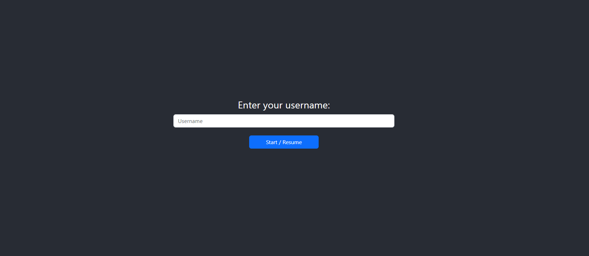
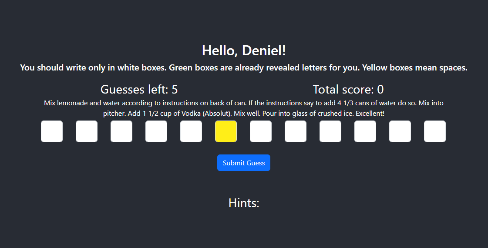
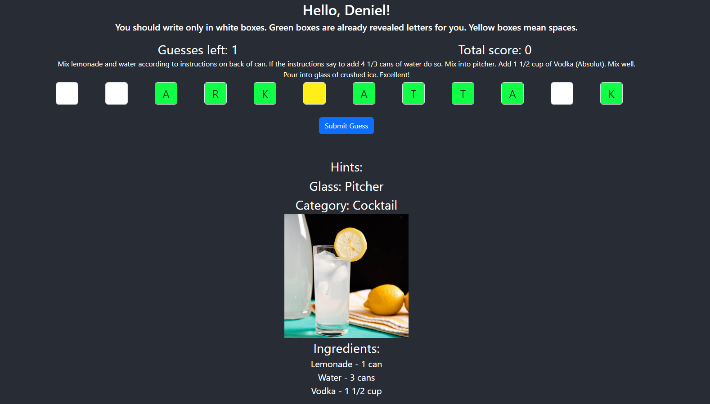

# Cocktail Guessing Game

This is a simple web application that allows users to guess the name of a randomly selected cocktail. The application provides hints based on the user's guesses, and the backend handles the game logic, including scoring and tracking revealed letters.

## Project Setup

### Backend

- **JDK**: 21
- **Spring Boot**: 3.3.3
- **Database**: H2 (in-memory)
- **Libraries**:
    - Lombok
    - Liquibase
    - Spring JPA
    - Spring Web

#### Running the Backend

1. **Clone the repository**:
   ```bash
   git clone https://github.com/XDftr/ridango-test-assignment.git
   cd ridango-test-assignment
   ```

2. **Build the project**:
   ```bash
   ./gradlew clean build
   ```

3. **Run the application**:
   ```bash
   ./gradlew bootRun
   ```

4. The backend will be available at `http://localhost:8080`.

### Frontend

- **React**
- **Bootstrap**
- **Axios**

#### Installing and Running the Frontend

1. **Navigate to the frontend directory**:
   ```bash
   cd frontend
   ```

2. **Install dependencies**:
   ```bash
   npm install
   ```

3. **Start the development server**:
   ```bash
   npm start
   ```

4. The frontend will be available at `http://localhost:3000`.

## API Endpoints

### Create a Game Session

- **URL**: `/api/game`
- **Method**: `POST`
- **Request Body**:
    - `username` (string): The username of the player.

- **Response**:
    - `GameSessionResponseDto`: Contains details about the newly created game session.

### Submit a Guess

- **URL**: `/api/game/{gameSessionId}`
- **Method**: `POST`
- **Request Body**:
    - `cocktailName` (string): The guessed name of the cocktail.

- **Response**:
    - `GameSessionResponseDto`: Contains updated details about the game session after the guess.

## Frontend Images

### Username form


### Cocktail guessing





